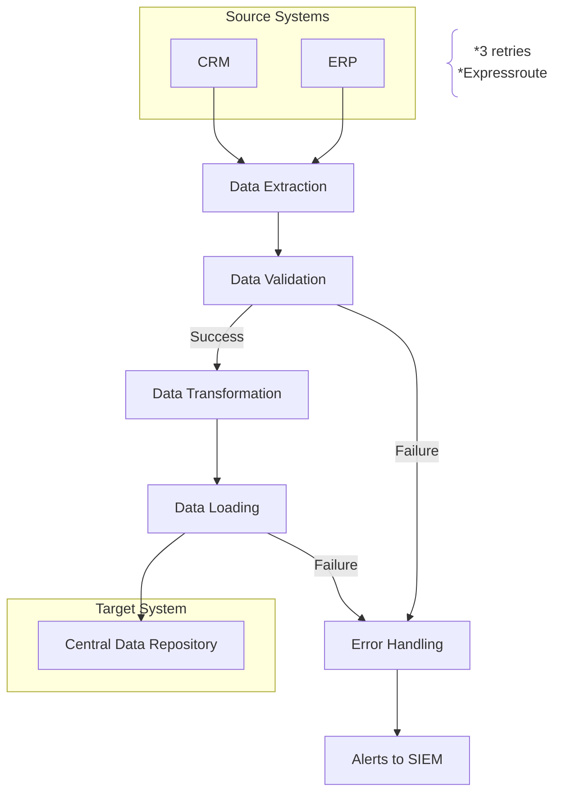

# Discovery Elaboration for Integration Template

## Introduction
This Document is designed to elaborate on the requirements captured using the discovery workshop data collection sheet for a specific integration scenario. It includes both functional and non-functional requirements specific to Azure Integration Services (AIS) implementation. The flowchart can be created using Mermaid flowchart capability for clear and effective visualization.

## Functional Requirements
Functional requirements define the specific behavior or functions of the AIS solution for the integration scenario. These include:

- **Data Integration**: The AIS solution must integrate data from specific sources, such as on-premises databases, cloud services, and third-party APIs relevant to the integration scenario.
- **Workflow Automation**: Implement Logic Apps to automate business processes and workflows specific to the integration scenario, ensuring seamless data flow between systems.
- **Message Handling**: Use Service Bus to handle messages between different components involved in the integration, ensuring reliable and scalable communication.
- **API Management**: Manage and secure APIs using API Management, providing a centralized platform for API publishing, monitoring, and analytics specific to the integration scenario.
- **Event Handling**: Utilize Event Grid to handle and route events between different services involved in the integration, enabling real-time processing and response.

## Non-Functional Requirements
Non-functional requirements define the quality attributes of the AIS solution for the integration scenario. These include:

- **Scalability**: The AIS solution must be able to scale horizontally to handle increased load and data volume specific to the integration scenario.
- **Performance**: Ensure that the AIS components perform efficiently, with minimal latency and high throughput for the integration scenario.
- **Security**: Implement robust security measures, including authentication, authorization, and encryption, to protect data and services involved in the integration.
- **Reliability**: Ensure high availability and fault tolerance of the AIS solution, with mechanisms for automatic failover and recovery specific to the integration scenario.
- **Compliance**: Adhere to relevant regulatory and compliance standards, such as GDPR, HIPAA, and ISO 27001, for the integration scenario.

## Creating the Flowchart
The flowchart can be created using Mermaid, a powerful tool for generating diagrams and flowcharts from text:

### Integation 01

