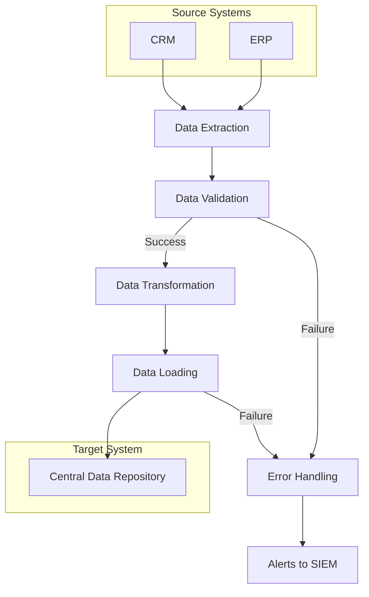

```mermaid
flowchart TD
A[Data Extraction]@{ shape: comment, label: "Apply business rules: data format validation, mandatory field checks, data completeness verification" }

    A[Data Extraction] --> B[Data Validation]
    B -->|Success| C[Data Transformation]
    B -->|Failure| E[Error Handling & Notifications]
    C --> D[Data Loading]

    D -->|Failure| E[Error Handling]
    E --> F[Alerts to SIEM]

    subgraph Source Systems
        A1[ERP]
        A2[CRM]
    end

    subgraph Target System
        D1[Central Data Repository]
    end

    A1 --> A
    A2 --> A
    D --> D1

```